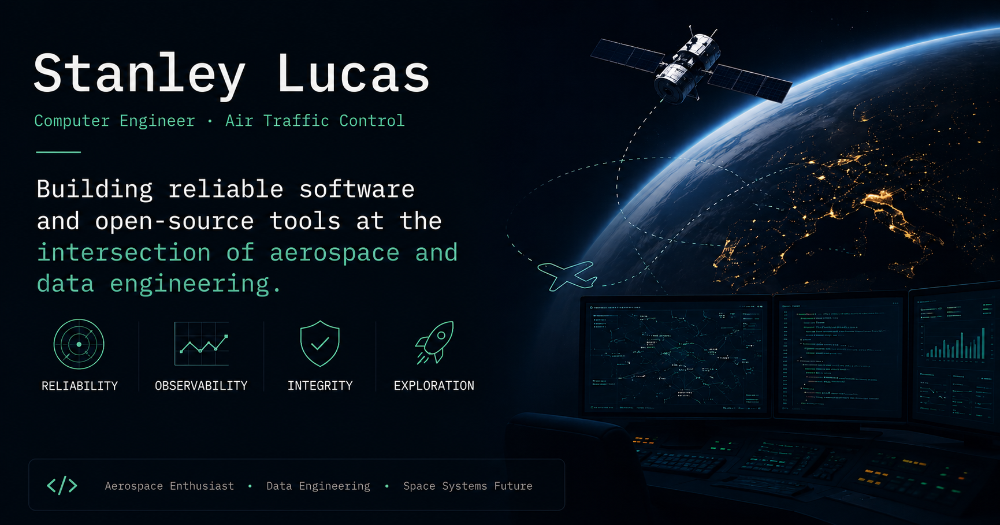

# My Own Mind

Personal blog about building software at the intersection of aerospace and data engineering — reliability, observability, and the tools that make both possible.

Live at **[stanley-lucas.github.io](https://stanley-lucas.github.io)**.

---

## What I write about

- AI-assisted development workflows and tooling
- Data engineering and telemetry systems
- Aerospace software — ATC, flight data, space systems
- Open-source tools I build along the way

## Stack

| | |
|---|---|
| Framework | [Astro](https://astro.build/) + [AstroPaper](https://github.com/satnaing/astro-paper) |
| Language | TypeScript |
| Styling | TailwindCSS |
| Comments | [Giscus](https://giscus.app/) |
| Deployment | Cloudflare Pages |

## Running locally

```bash
pnpm install
pnpm dev        # localhost:4321
pnpm build      # type-check + build + pagefind index
pnpm preview    # preview build before deploy
```

## Writing a post

Create a `.md` file in `src/content/posts/`. Required frontmatter:

```yaml
---
title: "Post title"
pubDatetime: 2026-01-01T00:00:00-03:00
description: "One sentence description."
featured: false
tags:
  - tag
---
```

Set `draft: true` to keep a post out of the build.
